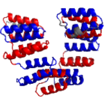
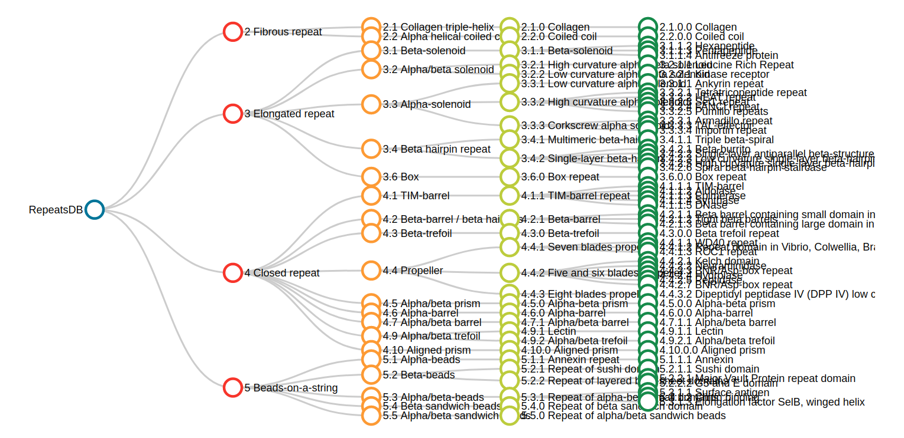
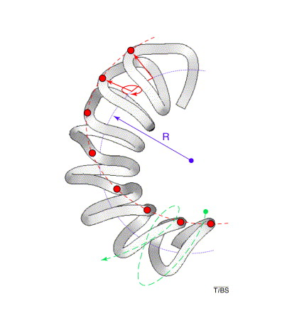
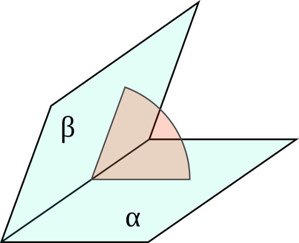
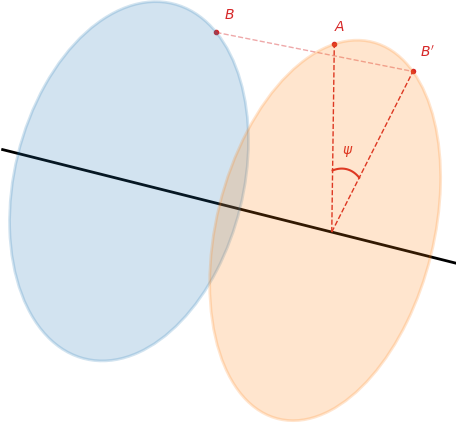

# Objective
Classify **repeat proteins** based on **geometric parameters** derived from their **3D coordinates**. Where:

* **Repeat proteins**: Repeat proteins are proteins that contain **protein tandem structure repeats**, arrays of multiple (at least 2) similar or identical structural motifs. We are particularly interested in elongated repeats (solenoids, beta-hairpins and, to a lesser degree, box)

* **Geometric parameters**: *curvature*, *handedness* and *twist* are defined in <cite data-cite="kobe_when_2000">(A. V. Kajava et al. 2000)</cite>. These are the initial parameters that we will consider, they might be expanded, modified or renamed in later stages.

* **3D coordinates**: Three dimensional coordinates of the protein are usually referred to as the "protein structure". Structures for many proteins are contained in [PDB](https://www.rcsb.org/) <cite data-cite="berman_protein_2000">(H. M. Berman et al. 2000)</cite>

## Repeat Proteins
Repeat proteins can refer to the class of proteins that contain tandem repeats in their sequence or to the class of proteins that contain tandem repeats in their structure. This project focuses on structural repeats.

Repeat proteins are proteins with a fold that exibhits a certain amount of repetitivity. In the Figure 1 repeated portions of the protein (**repeated units**) alternate and are marked in different colors:



**Figure 1**: An alpha solenoid (PDB 5i9g chain C). An example of repeat protein belonging to class 3 (elongated repeat), topology 3 (alpha-solenoid). Image source: [RepeatsDB](https://repeatsdb.bio.unipd.it/).

Repeat proteins can be classified on the basis of structural and sequence features. The classification we use is explained in <cite data-cite="paladin_repeatsdb_2017">(L. Paladin et al. 2017)</cite>. The classification is organized in 4 hierarchical layers, from broader to narrower: 
$\color{red}{\textbf{Class}}$, 
$\color{orange}{\textbf{Topology}}$, 
$\color{YellowGreen}{\textbf{Fold}}$, 
$\color{darkgreen}{\textbf{Clan}}$.
The full classification is shown in Figure 2.



**Figure 2**: Complete classification of repeat proteins as proposed in <cite data-cite="paladin_repeatsdb_2017">(L. Paladin et al. 2017)</cite>. Image source: [RepeatsDB](https://repeatsdb.bio.unipd.it/).

In this project we want to focus on (in order of importance) $\color{red}{\textbf{Class 3}}$ (elongated repeats), in particular on $\color{orange}{\textbf{topologies}}$ (in order of importance):

* $3.1$, $3.2$, $3.3$ (solenoids)
* $3.4$ ($\beta$-hairpin)
* $3.6$ (box)

## Geometric Parameters
The three geometric parameters that we want to extract from 3d coordinates are:

* $\color{RebeccaPurple}{\textbf{Curvature}}$
* $\color{Green}{\textbf{Handedness}}$
* $\color{Red}{\textbf{Twist}}$

These are defined in <cite data-cite="kobe_when_2000">(A. V. Kajava et al. 2000)</cite> and especially in Figure 3 (Figure 1 of <cite data-cite="kobe_when_2000">(A. V. Kajava et al. 2000)</cite>).



**Figure 3**: A schematic representation of a solenoid structure used in <cite data-cite="kobe_when_2000">(A. V. Kajava et al. 2000)</cite> to explain the geometric parameters proposed in that article to characterize that class of repeats.

Caption from Figure 3 (Figure 1 in <cite data-cite="kobe_when_2000">A. V. Kajava et al. 2000</cite>) reads (color added for clarity):

> A schematic representation of a solenoid protein structure. The diagram illustrates the basic parameters of solenoid structures: $\color{RebeccaPurple}{\text{curvature}}$ (magenta); $\color{Green}{\text{handedness}}$ (green) and $\color{Red}{\text{twist}}$ (red). $\color{RebeccaPurple}{\text{Curvature}}$ is described by the radius (R) of the superhelical axis; the smaller the radius, the larger the $\color{RebeccaPurple}{\text{curvature}}$. $\color{Green}{\text{Handedness}}$ of the solenoid polypeptide chain describes the direction in which the polypeptide chain winds along the superhelical axis. The solenoid in the figure is left-handed. $\color{Red}{\text{Twist}}$ is determined by following analogous reference points in consecutive structural units (red dots). When connected, these points form a virtual helix (red dashed line). The $\color{Green}{\text{handedness}}$ of the $\color{Red}{\text{twist}}$ is therefore the $\color{Green}{\text{handedness}}$ of this helix as it winds around the superhelical axis. The solenoid in the figure has a left-handed twist. The magnitude of the $\color{Red}{\text{twist}}$ is determined by the size of a dihedral angle (the angle when projected onto a plane perpendicular to the superhelical axis) between the vectors (red arrows) connecting the superhelical axis with the reference points in two consecutive structural units; the larger the angle, the larger the $\color{Red}{\text{twist}}$. Note that the definition used here for the solenoid $\color{Red}{\text{twist}}$ differs from the usual definition of the $\color{Red}{\text{twist}}$ in β sheets

### Basic assumption
These geometrical parameters assume that repeat proteins (in this case solenoid structures) are organized as superhelices, which is almost never the case. This assumption however accounts for repeated units organized in helices that winds up around a curved axis in 3 dimensions. This means that most likely we will never find perfect examples of superhelices but rather helices with curved axis.

### Nomenclature disambiguation
The second sentence of the caption of Figure 3 (Figure 1 in <cite data-cite="kobe_when_2000">A. V. Kajava et al. 2000</cite>) states:

> Curvature is described by the radius (R) of the superhelical axis; the smaller the radius, the larger the curvature.

The sentence describes the curvature in relation to the radius of the superhelix. However the sentence refers to the "radius of the superhelical axis". This introduces a sistematic error in nomenclature that returns througout the caption. 

An axis is "*The imaginary straight line about which a body (e.g. the earth or other planet) rotates*" <cite data-cite="noauthor_axis_nodate">(OED Online - axis)</cite>. In this sense, the superhelical axis would be the center (purple dot) of the superhelix curve (purple line). The figure in fact offers a view of the superhelix from the perspective of an observer sitting on top of the $Z$-axis so that the purple dot represents the projection (on the $XY$ plane) of the axis around which the superhelix winds, namely the superhelical axis. 

Now it should be noted that the term used is *superhelic-al axis*, as in "an axis with a superhelical shape", rather than the term *superhelix axis*, as in "the axis of the superhelix". Thus the language used is not necessarily wrong, however I think it is ambiguous and I found it extremely confusing.

This ambiguous nomenclature is used consistently through the caption so that every time that we encounter the term "superhelical axis", it should be interpreted as "superhelix". To further improve the clarity of this text, in this project we will use the following nomenclature:

* **helix**: is the small helix, represented as a white shaded coil in the picture. The helix winds around the helix axis which is organized itself as a superhelix.
* **superhelix**: is the large helix, represented as a purple dashed line in the picture. The superhelix is the axis of the helix and revolves around the superhelical axis.
* **superhelical axis**: is the (straight) axis around which the superhelix revolves.

### Curvature
From the caption:

> $\color{RebeccaPurple}{\text{Curvature}}$ is described by the radius (R) of the superhelical axis; the smaller the radius, the larger the curvature.

From the disambiguation section we know that "superhelical axis" reads "superhelix", so the $\color{RebeccaPurple}{\text{curvature}}$ increases when the radius of the superhelix decreases. When the radius ($R$) tends to be infinitely big, there is no $\color{RebeccaPurple}{\text{curvature}}$ ($C$).

$$\lim_{R \to +\infty} C(R) = 0$$

From the definition above, $\color{RebeccaPurple}{\text{curvature}}$ is a measure that could be entirely described by the radius ($R$)  of the superhelix. There might be two reasons not to use the latter in place of the former:
 
  1. It is very common that repeat proteins only describe a very small fragment of the superhelix, which can be defined only by virtually repeating the fragment with a simmetry operation. For this reason it is more intuitive to talk about the "$\color{RebeccaPurple}{\text{curvature}}$ of the repeat" compared to "the radius of the hypothetical superhelix described by applying rotational symmetry operations to the repeat protein".
  2. A number of repeat proteins have no $\color{RebeccaPurple}{\text{curvature}}$. This means that a significant proportion of proteins would be described by a geometrical parameter with undefined value ($\infty$).

###  Handedness
From the caption:

> $\color{Green}{\text{Handedness}}$ [...] describes the direction in which the polypeptide chain winds along the superhelical axis. The solenoid in the figure is left-handed.

$\color{Green}{\text{Handedness}}$ is a property of objects often found in many scientific fields and it is commonly called $\color{Green}{\textbf{chirality}}$. The definition of a chiral object (from the [chirality article in Wikipedia](https://en.wikipedia.org/wiki/Chirality)) is: "*An object or a system is chiral if it is distinguishable from its mirror image; that is, it cannot be superimposed onto it*". 

While chirality is a term widely used in chemistry, it's cause in molecules is the presence of an asymmetric carbon atom. The description of $\color{Green}{\text{chirality}}$ in <cite data-cite="kobe_when_2000">(A. V. Kajava et al. 2000)</cite> closely resembles that used in Electromagnetism, where electromagnetic waves can have $\color{Green}{\text{handedness}}$ associated with their polarization.

In this interpretation $\color{Green}{\text{handedness}}$ is defined from the point of view of the receiver. A circularly polarized electromagnetic radiation moves in a direction described by a vector. The vector originates from an origin point and is observed at a receiver point. At the receiver point the observer will experience the polarized radiation in clockwise (Right handed) or counter-clockwise (Left handed) direction. When applying this definition to a repeat protein the origin point is the N-terminus and the receiver point is the C-terminus.


**Figure 4**: Representation of two in-phase components with left and right circular polarizations respectively of light radiation (© Chiralabs 2011). Source: <cite data-cite="yamamoto_hisashi_yamamoto_erick_carreira_separations_2012">(Comprehensive Chirality)</cite>

>   
>    

### Twist
From the caption:

> $\color{Red}{\text{Twist}}$ is determined by following analogous reference points in consecutive structural units (red dots). When connected, these points form a virtual helix (red dashed line).

and also:

> The magnitude of the $\color{Red}{\text{twist}}$ is determined by the size of a dihedral angle (the angle when projected onto a plane perpendicular to the superhelical axis) between the vectors (red arrows) connecting the superhelical axis with the reference points in two consecutive structural units.

Where "superhelical axis" reads as "superhelix". The $\color{Red}{\text{twist}}$ is described in the caption as the radial distance between the same point in two repeated units. A couple of points follow this definintion; you can have twist:
 
 * even for a superhelix with $\color{RebeccaPurple}{\text{curvature}} = 0$;
 * only when repeated structures organized in an helical pattern are sufficiently similar that an analogogus point can be defined.
 
#### Twist of the superhelix

In principle, $\color{Red}{\text{twist}}$ could be defined for the superhelix too, however entire superhelices are most likely non-existent in nature or anyway a very rare case. Instead we usually find helices winded around curved axis which, if virtually extended, would draw an helix themselves. For this reason for most proteins there won't be two consecutive repeated structures around the axis of the superhelix and it would be thus impossible to calculate their $\color{Red}{\text{twist}}$.

#### Dihedral angle
The term dihedral angle is not immediately clear to me in this context. In math, "A dihedral angle is the angle between two intersecting planes" (from the [dihedral angle article in Wikipedia](https://en.wikipedia.org/wiki/Dihedral_angle)) as shown in Figure 5. 



**Figure 5**: The dihedral angle (red) is the part of the space between two half-planes (pale blue). Image source: wikipedia users - this version: CheChe; Original: Luca Antonelli.

However this does not immediately translates to the current situation since the two planes are not immediately idntifiables, moreover the caption descibes the diehdarl angle as the "the angle when projected onto a plane perpendicular to the superhelical axis" that, while being relatively easy to understand, contributes to the confusion arising from the double definition. I will further expand on this in the problem formalization section. At the moment Figure 6 is enough to visualize the definition given in <cite data-cite="kobe_when_2000">(A. V. Kajava et al. 2000)</cite>.



**Figure 6**: A drawing of the dihedral (torsion) angle as explained the caption of Figure 3 (Figure 1 in <cite data-cite="kobe_when_2000">A. V. Kajava et al. 2000</cite>). Torsion is defined by first identifyng two analogous points ($A$, $B$) in successive turns of the helix (In this case we are just arbitrarily placing the two points since there is no way to define analogous points in two circles). The $\color{Red}{\text{twist}}$ ($\psi$) is the angle between $A$ and the projection of $B$ ($B'$) on the plane defined by $A$ and the helix axis.


```python

```
